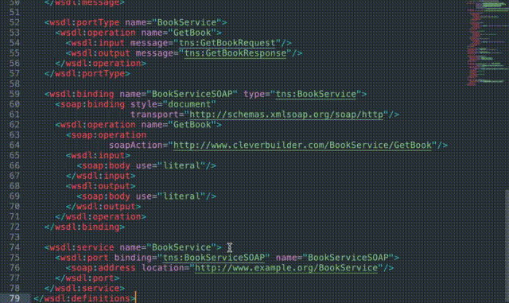

# Clickable WSDL (and XSD)  

  
A plugin for [Sublime Text](http://sublimetext.com) that turns WSDL and XSD types into clickable links!  
  
  
  
## Summary  
  
This Sublime Text plugin turns WSDL and XSD `type`s, `ref`s, `base`s, `element`s, `message`s, and `binding`s, into clickable links to their defintions.  

If you don't like using a mouse, you can also navigate them with a keyboard shortcut. See [Configuration](#configuration) below.  

## Installation

Install via Sublime's Package Control: `Preferences > Package Control > Install Package`, search and select `Clickable WSDL`.
  
> **Note:** you need to manually enable mouse and/or key bindings to make the links clickable/navigable. See [How to Configure Mouse Bindings](#how-to-configure-mouse-bindings) and [How to Configure Key Bindings](#how-to-configure-key-bindings) below.  
  
## Configuration  
  
All configuration is done via the settings file that you can open via the main menu: `Preferences > Package Settings > Clickable WSDL > Settings - User`.  
  
### How to Configure Mouse Bindings  
To rebind mouse keys, open `Preferences > Package Settings > Clickable WSDL > Mouse Bindings - User`.  
  
For example, to navigate the links using `alt+click`:  
```json  
[{  
  "button": "button1",
  "count": 1,
  "modifiers": ["alt"],
  "command": "navigate_to_link_under_cursor",
  "press_command": "drag_select"
}]  
```  
  
### How to Configure Key Bindings  
To configure keyboard shortcuts, open `Preferences > Package Settings > Clickable WSDL > Key Bindings - User`.  

For example, to navigate the links using `super+option+enter`:
```json
[
    { "keys": ["super+option+enter"], "command": "navigate_to_link_under_cursor" }
]
```
  
### Note on Performance
To protect Sublime's performance, the plugin is automatically disabled if the document has more than 1000 clickable links. This can be configured via the `max_clickable_limit` settings option. To configure this, go to `Preferences > Package Settings > Clickable WSDL > Settings - User` and set:

```json
{
	"max_clickable_limit": 10000
}
```

### Note on Sublime Text 2  
Unfortunately, in Sublime Text 2 the only way to underline a block of text is a hack with underlining empty regions, and there is no way to control its appearance. If you want, you can disable link highlighting by setting the option `highlight_urls` to false.  
  
Note: this isn't an issue with Sublime Text 3.  

---

## Acknowledgements  
  
This plugin borrows many concepts from [Leonid Shevtsov](http://leonid.shevtsov.me)'s [Clickable URLs](https://github.com/leonid-shevtsov/ClickableUrls_SublimeText) plugin. Thank you Leonid!

If you've found Clickable WSDL valuable, please consider buying me a "coffee" 😁:

<a href="https://www.buymeacoffee.com/lwilli" target="_blank"></a>
 
